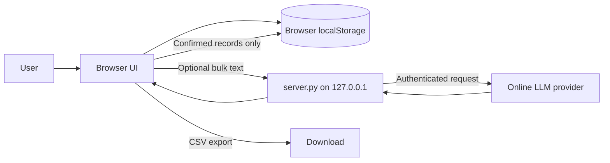

# Split Calculator — Project Report and Maintenance Guide

## 1. Purpose and scope

This is a lightweight, local-first household expense splitting application. It is designed to run on one computer without a database server. The browser stores the ledger locally, while an optional local Python proxy can call an online, OpenAI-compatible LLM for bulk text parsing.

The application supports:

- Manual shared-expense entry.
- Manual balance-transfer/reimbursement entry.
- Equal, exact, and percentage splits.
- People management.
- Automatic balances and minimal settlement suggestions.
- Expense categories and category icons.
- Date-grouped transaction activity.
- Editing and deleting transactions.
- CSV export suitable for audit/review.
- AI-assisted bulk transaction suggestions with a user review step.

The design principle is intentionally conservative: **the model suggests data, the user confirms it, and the application performs all financial calculations deterministically.**

## 2. Repository map

| Path | Responsibility |
| --- | --- |
| `index.html` | Static user interface and all form/control markup. |
| `styles.css` | Responsive visual design, category icon styling, form layout, and activity grouping. |
| `app.js` | Local data model, rendering, calculations, form workflows, CSV export, and AI-review client logic. |
| `server.py` | Local HTTP server and secure same-origin proxy for the LLM request. |
| `start.bat` | Windows launcher; starts the server and opens the application. |
| `.env` | Local LLM provider settings. Must never be committed or shared. |
| `.gitignore` | Ignores `.env` and Python cache files. |
| `package.json` / `node_modules` | Development-only `jsdom` dependency if present; the runtime application does not require Node.js packages. |
| `Docs/PROJECT_REPORT.md` | This maintenance and architecture report. |

## 3. Running the project

### Standard local use

1. Double-click `start.bat`.
2. It starts `server.py` on `http://127.0.0.1:8000/`.
3. It opens that address in the default browser.
4. Keep the command window open while using the application.

The local server is important because browser `localStorage` behavior for `file://` URLs is not consistent across browsers. It is also required for the AI parsing endpoint.

### Python requirement

The launcher tries `py` first and falls back to `python`. The project uses only Python's standard library, so no `pip install` step is required.

### LLM configuration

The server reads `.env` automatically. Expected variables are:

```env
LLM_API_KEY=your-secret-key
LLM_MODEL=provider-model-name
LLM_API_URL=https://provider.example/v1/chat/completions
```

The supplied configuration format targets OpenAI-compatible chat-completions APIs. The server also accepts an endpoint ending in `/v1` and appends `/chat/completions` automatically.

## 4. High-level architecture



### What is local and what is online

- Ledger data, balances, categories, and exports stay in browser `localStorage`.
- Manual entry works with no internet connection.
- AI bulk parsing sends only the pasted text, household names, and current date to the configured provider.
- API secrets stay in `.env` and are never sent to `app.js` or the browser.

## 5. Persistent data model

The `localStorage` key is `splitwise-local-ledger-v1`.

```js
{
  people: ["You", "Jai", "vasu"],
  expenses: [/* shared spending only */],
  transfers: [/* reimbursement / settlement only */]
}
```

### Person

```js
"Jai"
```

People are plain names. A person cannot be removed while referenced by an expense or transfer.

### Expense

```js
{
  id: "uuid",
  kind: "expense",
  date: "2026-08-20",
  category: "Food",
  description: "Groceries",
  amount: 2400,
  payer: "You",
  splitType: "equal", // equal | exact | percentage
  shares: [
    { person: "You", amount: 800 },
    { person: "Jai", amount: 800 },
    { person: "vasu", amount: 800 }
  ]
}
```

An expense is the only record type included in the dashboard's **Total tracked** and **expense count**.

### Transfer / reimbursement

```js
{
  id: "uuid",
  kind: "transfer",
  category: "Reimbursement",
  date: "2026-08-20",
  description: "Settling groceries",
  amount: 800,
  payer: "Jai",
  splitType: "exact",
  shares: [
    { person: "You", amount: 800 }
  ]
}
```

A transfer means **the payer gave money to the recipient**. It is not spending and is stored in `transfers`, not `expenses`.

### Migration of older data

`loadState()` migrates previous versions of the local record automatically:

1. It guarantees `people`, `expenses`, and `transfers` collections exist.
2. It normalizes category values.
3. Older reimbursement records found in the previous `expenses` collection are moved to `transfers`.
4. It accepts legacy `kind: "reimbursement"` values.
5. It recognizes common reimbursement spelling variants when categorizing legacy data.

The migrated object is immediately saved back to `localStorage` on application startup. No manual data migration is required.

## 6. Accounting rules (critical)

This section is the most important part of the project. Do not change these signs without updating tests and this document.

### Expense accounting

For an expense of amount `A` paid by `P` and split into share amounts `sᵢ`:

```text
balance[P] += A
balance[share.person] -= share.amount
```

Positive balance means the group owes that person money. Negative balance means that person owes the group money.

Example: You pay ₹1,000 shared equally by You and Jai.

```text
You: +1000 - 500 = +500
Jai: -500
```

### Transfer accounting

For a reimbursement of amount `A` paid by `P` to recipient `R`:

```text
balance[P] += A
balance[R] -= A
```

Example: Jai owes You ₹500 and pays You ₹500.

```text
Before: You +500, Jai -500
Transfer: Jai +500, You -500
After:  You 0, Jai 0
```

This direction is intentional. A payer in a settlement becomes **less indebted**, and the recipient becomes **less owed**. Reversing these signs causes reimbursements to make debts larger.

### Settlement generation

`settlements()`:

1. Reads the final net balances after all expenses and transfers.
2. Separates negative balances into debtors and positive balances into creditors.
3. Greedily matches the largest outstanding debtor and creditor until all balances are near zero.
4. Ignores residual values below ₹0.005 to avoid floating-point noise.

Transfers affect settlement suggestions because they are intended to reduce existing debt. They do not appear as new expenses in totals or counts.

## 7. User interface flows

### Expense entry

The default top-form mode is **Expense**. It contains:

- Description.
- Amount.
- Payer.
- Date.
- Category.
- Participants.
- Share type.

The form defaults to equal splitting and all current household members selected. After a transaction is saved, the form resets to that safe default.

Share validations:

- Equal: creates `amount / selectedPeople.length` for each selected person.
- Exact: entered share amounts must add up to the expense amount.
- Percentage: entered percentages must add up to 100.

### Balance transfer entry

The small mode switch at the top of the entry card switches to **Transfer**. This is a separate form to avoid treating repayments like spending.

Fields:

- Optional note.
- Amount.
- Paid by: person settling their debt.
- Paid to: person receiving the settlement.
- Date.

Rules:

- Payer and recipient must be different.
- It always saves `kind: "transfer"` and `category: "Reimbursement"`.
- It always uses an exact single-recipient share.
- It is never included in expense totals.

### Editing and deleting

- Every activity row has **Edit** and **Delete** actions.
- Editing an expense opens Expense mode.
- Editing a transfer opens Transfer mode.
- Delete requires a browser confirmation, removes the record from either collection, saves state, and recalculates balances.

### Categories

The category list is:

- Fuel
- Food
- Snacks
- Outing
- Rent
- Reimbursement
- Others

Reimbursement is intentionally omitted from the manual Expense category selector because transfers have a dedicated mode. It remains available to AI review and legacy data migration.

Each category has a visual icon/color in activity:

| Category | Icon |
| --- | --- |
| Fuel | ⛽ |
| Food | 🍴 |
| Snacks | 🍪 |
| Outing | ✦ |
| Rent | ⌂ |
| Reimbursement | ↔ |
| Others | • |

### Activity history

Activity is built from `expenses + transfers`, sorted descending by ISO date and grouped by date. A group displays a shared date block to the left and one row per transaction to the right. Transfers are labelled “balance transfer” and “not an expense.”

## 8. AI-assisted bulk input

### Browser flow

1. User pastes natural-language descriptions into the AI Assist box.
2. `app.js` posts `{ text, people }` to `/api/parse-expenses`.
3. `server.py` calls the configured provider.
4. The browser normalizes provider output into review rows.
5. The user can edit description, amount, date, category, payer, participants, split type, and share values.
6. Only **Confirm all** writes records to local storage.

### Required model output

The system prompt requests JSON shaped like:

```json
{
  "expenses": [
    {
      "description": "string",
      "amount": 0,
      "date": "YYYY-MM-DD",
      "category": "Fuel|Food|Snacks|Outing|Rent|Reimbursement|Others",
      "payer": "string",
      "participants": ["string"],
      "split_type": "equal|exact|percentage",
      "shares": { "Person": 0 }
    }
  ],
  "notes": ["string"]
}
```

### Provider compatibility normalization

Some models return equivalent but differently named fields. `normalizeSuggestion()` accepts common aliases:

| Preferred field | Accepted aliases |
| --- | --- |
| `amount` | `total` |
| `payer` | `paid_by` |
| `participants` | `split_with` |
| current user | `self`, `me` |

When a provider returns `split_with`, the payer is included as a participant if necessary because many models interpret “split with” as people other than the payer.

### AI safety and validation

The model output is not trusted directly. Client-side confirmation validates:

- Positive amounts.
- Known household members.
- At least one participant.
- Exact and percentage totals.
- A reimbursement recipient cannot also be the payer.

The AI may classify a reimbursement. On confirmation it is routed to `transfers`; all other records route to `expenses`.

## 9. File-by-file code guide

### `index.html`

Defines the application shell, not business logic.

- Header: brand, local-save indicator, CSV export button.
- Hero: total tracked and expense count.
- AI Assist card: bulk text input, suggestions/review container, confirm button.
- Entry card: Expense/Transfer mode switch, expense form, separate transfer form.
- Activity card: date-grouped transaction history target.
- Balances card: per-person net balance and settlement target.
- People card: household management.

IDs are used by `app.js`; do not rename them without updating JavaScript selectors.

### `styles.css`

Contains the complete visual system:

- CSS custom properties for colors and shadows.
- Responsive desktop/mobile grid layout.
- Form/input/button/chip styling.
- Activity date-group layout.
- Per-category icon colors.
- AI bulk-review grid.

The stylesheet is intentionally self-contained and has no web-font import, preserving offline use.

### `app.js`

The app uses no framework or third-party runtime dependency. Its major responsibilities are:

| Function/group | Responsibility |
| --- | --- |
| `loadState`, `saveState` | Persist state and migrate older reimbursement records. |
| `inferCategory`, `validCategory` | Normalize/derive categories for legacy records. |
| `isReimbursement`, `allTransactions`, `replaceTransaction` | Keep expenses and transfers structurally separate while providing unified history operations. |
| `renderPeople`, `renderCategories`, `renderParticipants` | Render dynamic person/category UI controls. |
| `resetExpenseForm`, `resetTransferForm`, `setEntryMode` | Manage the two top-form workflows. |
| `balances`, `settlements` | Deterministic ledger and settlement calculations. |
| `renderDashboard`, `renderActivity` | Render totals, balances, suggestions, date groups, icons, and activity actions. |
| `addExpense`, `addTransfer` | Validate and write the two distinct transaction types. |
| `editExpense` | Route a record to Expense or Transfer mode for editing. |
| `normalizeSuggestion`, `parseBulkText`, `confirmBulk` | Handle AI output, user review, and validation. |
| `exportCsv` | Create a local download containing both expense and reimbursement records plus final balances. |

### `server.py`

This is deliberately small and uses `http.server` plus `urllib.request` only.

- `load_env_file()` parses the local `.env` file without `python-dotenv`.
- `Handler` serves static application files by inheriting from `SimpleHTTPRequestHandler`.
- `Handler.do_POST()` implements only `/api/parse-expenses`.
- It validates pasted text and the presence of `LLM_API_KEY`.
- It creates an OpenAI-compatible chat-completions request with JSON-object mode.
- It adds `Accept` and browser-like `User-Agent` headers. These are needed in this setup because the configured provider’s Cloudflare edge rejected Python’s default request fingerprint.
- It returns provider JSON to the browser or a compact error object.
- It binds only to `127.0.0.1`, preventing accidental network exposure on the local LAN.

### `start.bat`

The launcher:

1. Changes into the directory containing itself.
2. Uses port 8000.
3. Opens the browser address.
4. Starts `py server.py` when the Python launcher exists, else `python server.py`.

## 10. CSV export contract

The download includes these columns:

```text
Record type, Date, Description, Category, Payer, Payee / Person,
Split type, Expense amount, Share amount, Balance after all expenses
```

`Record type` is `Expense`, `Reimbursement`, or `Balance`.

Each expense/transfer produces one row per person share. Final balance rows follow the transaction rows. This denormalized layout is intentionally friendly to spreadsheet formulas, audits, and AI review.

## 11. Verification performed

The following static checks are appropriate for this dependency-light project:

```powershell
node --check app.js
python -m py_compile server.py
```

For a manual smoke test:

1. Start the app with `start.bat`.
2. Add an equal-split expense.
3. Verify balances and suggested settlement.
4. Add a transfer from the debtor to creditor for the suggested amount.
5. Confirm both relevant balances move to zero and Total tracked does not change.
6. Edit and delete one transaction.
7. Use AI Assist with a short sample and review before confirming.
8. Export CSV and inspect the record types and final balance rows.

## 12. Important maintenance rules

1. Never treat a reimbursement as an expense. Route it to `state.transfers`.
2. Preserve the transfer sign convention described in section 6.
3. Keep all monetary calculations deterministic and local. Do not let the LLM calculate balances.
4. Do not expose the API key to browser code or commit `.env`.
5. Keep the AI confirmation step. Do not auto-save model output.
6. When adding a category, update `CATEGORIES`, `CATEGORY_ICONS`, AI prompt instructions, category CSS, and this document.
7. When changing the storage shape, add a migration to `loadState()` and test prior local data.
8. Treat floating point values carefully; this application currently uses a ₹0.005 tolerance in settlement logic. A future high-precision upgrade should store paise as integer values.

## 13. Known limitations and future improvements

- The local data is browser/profile-specific. CSV export is the current backup mechanism.
- There is no import/restore UI yet.
- The app does not yet show an explicit transfer total or transfer-only history filter.
- There are no automated unit or end-to-end tests; add them before a large refactor.
- `server.py` is suitable for local/private use, not public deployment. A hosted version should use a production web framework, robust authentication, rate limiting, and a managed secret store.
- External model providers vary in their support for JSON output. Client-side normalization and review are intentional safeguards.
- The existing `jsdom` dependency is not used by the running application; it may be used later to build browser-like tests.

## 14. Handoff checklist for future agents

Before changing code:

1. Read this report and inspect `app.js` accounting functions.
2. Do not overwrite user local data.
3. Make a small manual backup through CSV export before storage migrations.
4. Run `node --check app.js` and `python -m py_compile server.py` after edits.
5. Manually verify an expense and a transfer cancel correctly.
6. Keep `.env` out of logs, commits, screenshots, and reports.

